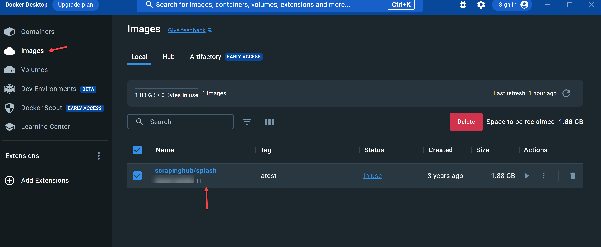
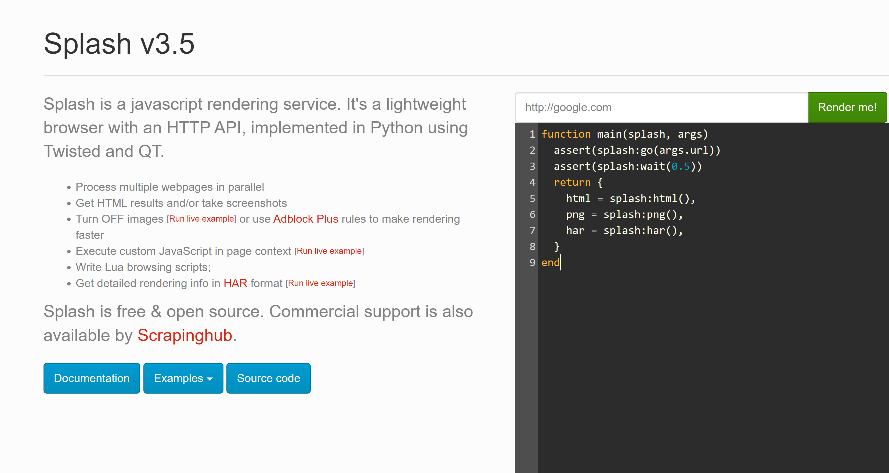

# Scrapy-Splash
A JS Rendering Service For Web Scraping.

#### This project includes 6 spiders that demonstrate how to use Scrapy-Splash to scrape websites that use JavaScript.

1. **Run Javascript** - Scrapy-Splash allows you to run javascript in your spiders. This is useful for changing elements on the page, clicking buttons, and other actions that require javascript.
2. **Screenshot** - Splash allows you to take screenshots of the page. This is useful for debugging and testing.
3. **Auto Scroll Any Website** - Splash allows you to auto scroll any website. This is useful for scraping websites that load data as you scroll down the page.
4. **Skip Page** - Splash allows you to click any button on the page (i.e. 'Next Button'). This is useful for skipping pages that you don't want to scrape.
5. **Wait For Full Page To Load** - Splash allows you to wait for the full page to load. This is useful for scraping websites that load data after the initial page load.
6. **Wait Time** - Splash allows you to set a wait time. This is useful for scraping websites that have a lot of javascript and take a long time to load.

<br>
---------------------------------------
<br>

## Getting Started
These instructions will get you a copy of the project up and running on your local machine for development and testing purposes.

1. Clone this project: `git clone https://github.com/iAlex0/Scrapy-Splash.git`
2. Create a Python Virtual Environment: `python -m venv venv`
3. Activate the Python Virtual Environment: `venv/Scripts/activate`
4. Install the project requirements: `pip install -r requirements.txt`
5. Change working directory to the project folder: `cd main_scraper`
6. Run the following command: `scrapy list` 
    - Returns the following:

        - run_javascript
        - screenshot
        - scroll_page
        - skip_page
        - wait_for_full_page_to_load
        - wait_time

<br>
---------------------------------------
<br>

## How To Install Docker
1. Download Docker Desktop: https://www.docker.com/products/docker-desktop
2. Install Docker Desktop
3. Open Docker Desktop

You can check that docker is installed correctly  by running the command below:
    
```python
docker --version
```
If it is recognized then you should be good to go.

<br>

## Install & Run Scrapy Splash
1. Run the following command: 

Windows:
```bash
docker pull scrapinghub/splash
```

Linux:
```bash
sudo docker pull scrapinghub/splash
```
<br>
If everything has worked correctly, when you open you Docker Desktop on the Images tab you should see the scrapinghub/splash image:


<br>
2. Run the following command: 

Windows:
```bash
docker run -p 8050:8050 scrapinghub/splash
```

Linux:
```bash
sudo docker run -it -p 8050:8050 --rm scrapinghub/splash
```
<br>
To check that Splash is running correctly, go to http://localhost:8050/ and you should see the following screen:


<br>
If you do then, Scrapy Splash will be up and running correctly, and all our requests will be made through our Splash server, ensuring that any JavaScript on the page is rendered.
<br>

<br>
---------------------------------------
<br>

## Running The Scrapers
Enter one of the following commands:

| Spider  |      Command      |
|----------|-------------|
| **Run Javascript** |  `scrapy crawl run_javascript` | 
| **Screenshot** |  `scrapy crawl screenshot` | 
| **Auto Scroll Website** |  `scrapy crawl scroll_page` |
| **Skip Page** |  `scrapy crawl skip_page` |
| **Wait For Full Page To Load** |  `scrapy crawl wait_for_full_page_to_load` |
| **Wait Time** |  `scrapy crawl wait_time` |

<br>
---------------------------------------
<br>

## License
MIT © iAlex0


